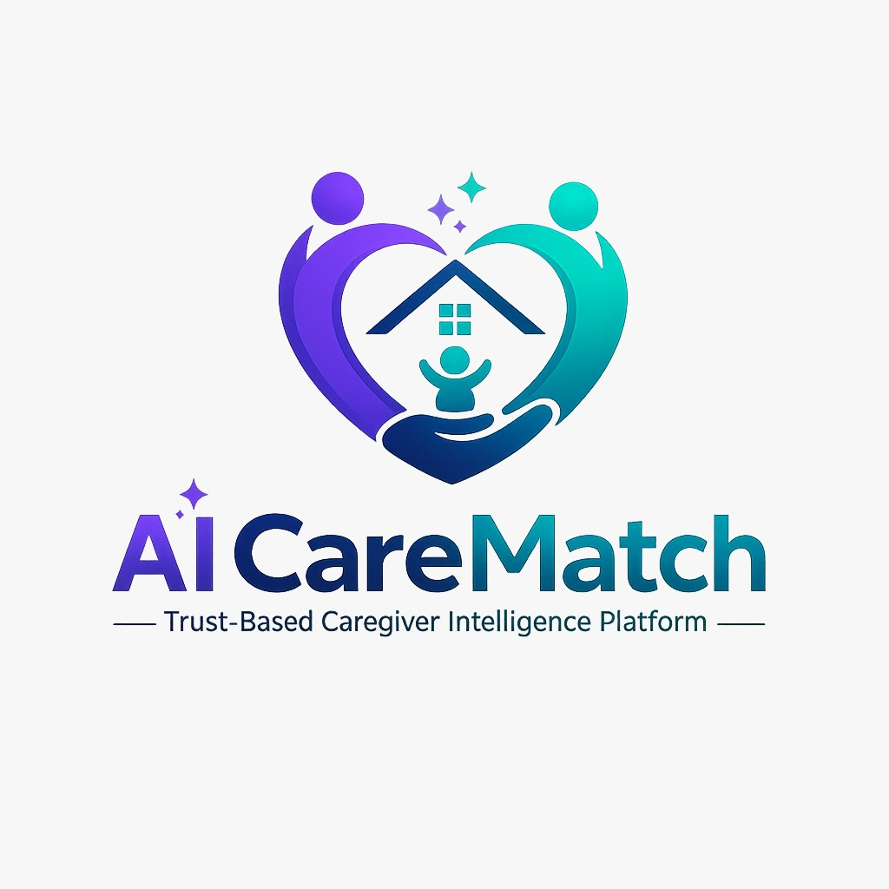

<p align="center">
  
</p>

<h1 align="center">AI CareMatch</h1>
<h3 align="center">Trust-Based Caregiver Intelligence Platform</h3>

<p align="center">
  <em>AI CareMatch doesn't just find caregivers — it helps you choose the right one, safely and confidently.</em>
</p>

<p align="center">
  
  
  
  
  
  
</p>

<p align="center">
  <a href="https://ai-care-match.vercel.app/">
    
  </a>
  
</p>

<p align="center">
  <a href="#-features">Features</a> •
  <a href="#-tech-stack">Tech Stack</a> •
  <a href="#-quick-start">Quick Start</a> •
  <a href="#-architecture">Architecture</a> •
  <a href="#-demo">Demo</a> •
  <a href="#-project-structure">Structure</a> •
  <a href="#-roadmap">Roadmap</a>
</p>

---

## 🧠 What is AI CareMatch?

India has **50 million+ families** actively searching for caregivers — for children with special needs, aging parents, and pets with health conditions. The process is **unsafe** (no verification), **opaque** (no explainability), and **inefficient** (manual searching).

**AI CareMatch** solves this with a proprietary **6-dimension AI matching engine**, real-time government verification, and **Explainable AI (XAI)** — delivering scored, transparent caregiver recommendations **in under 30 seconds**.

### 🎯 Three Care Domains

| Domain | Description | Use Cases |
|--------|-------------|-----------|
| 👶 **Child** | Babysitting, nanny, special-needs support | ADHD, autism, infant & toddler care |
| 🧑 **Human** | Elder care, adult care, post-surgery | Dementia, 24-hour home care, physiotherapy |
| 🐾 **Pet** | Breed-specific handlers, health-aware | Separation anxiety, dietary needs, behavioral therapy |

> **One caregiver = One domain.** A child specialist cannot list as an elder care provider. This enforces genuine expertise.

---

## ✨ Features

### 🤖 AI-Powered Matching
- **6-Dimension Weighted Scoring** — Experience (25%), Availability (20%), Proximity (15%), Verification (15%), Reliability (15%), Budget Fit (10%)
- **Explainable AI (XAI)** — 5 human-readable reasons for every recommendation
- **Smart Alternative** — Second-best option with AI-generated trade-off comparison
- **Confidence Indicator** — Shows AI certainty (0-100%) based on query completeness
- **Risk Analyzer** — Detects emergency keywords and surfaces safety warnings
- **Budget Optimization Tips** — AI suggests minimal budget increases to unlock better matches
- **Surge Awareness** — Warns when 50%+ caregivers in the area are busy

### 🗣️ Natural Language & Voice Search
- **Dual NLP Parser** — Local regex engine + OpenAI GPT-4o for complex queries
- **Voice Input** — Web Speech API for zero-typing search
- **Example**: *"Need night shift help for my mother with Alzheimer's, near Kondapur, under ₹700"*

### 🔐 8-Point Verification & Safety
| # | Check | Method |
|---|-------|--------|
| 1 | Live Selfie | Real-time face capture (anti-spoofing) |
| 2 | Government ID | Aadhaar, PAN, DL upload with OCR |
| 3 | DigiLocker | Gov ID verification via DigiLocker API |
| 4 | Document OCR | AI-powered text extraction & validation |
| 5 | Police Clearance | Background check initiation |
| 6 | Reference Check | AI sentiment analysis (94% threshold) |
| 7 | AI Face Match | Selfie vs. ID photo comparison |
| 8 | Medical Screening | Skill quiz reviewed by certified medical professor |

**Verification Tiers**: 🟢 Basic → 🔵 Advanced → 🟣 Medical (computed dynamically)

### 🚨 SOS Emergency System
- **Role-based alerts** via Twilio WhatsApp
  - Patient SOS → Family contacts notified instantly
  - Caregiver SOS → Admin notified instantly
- **One-tap activation** from the navigation bar

### 🤖 CareBot AI Assistant
- **Contextual chatbot** powered by OpenAI GPT-4o
- **Mem0 memory integration** — remembers user preferences across sessions
- **Floating widget** accessible from any page

### 📊 Role-Based Dashboards

<table>
<tr>
<td width="50%">

**Patient Dashboard**
- 📋 Session tracking (active/completed)
- ❤️ Favourite caregivers with quick rebook
- 🏥 Family Safety Profile (emergency contacts, allergies, medications)
- 📈 Trust Insights (avg score, satisfaction rate)

</td>
<td width="50%">

**Caregiver Dashboard**
- 💰 Earnings dashboard (₹ total, per session, completion rate)
- 📚 Skill Upgrade Pathway (certifications + match-rate impact)
- 📊 Trust Score Trend (5-month bar chart)
- 🔔 Upcoming jobs & notifications

</td>
</tr>
</table>

### 🌐 Multilingual Support
- **4 languages**: English, हिन्दी (Hindi), తెలుగు (Telugu), தமிழ் (Tamil)
- **Instant switching** — reactive translation hook, no page reload
- **Auto-detection** from browser locale with localStorage persistence

### 🎨 Premium Design System
- Dark glassmorphism with light mode toggle
- Animated score gauges & radar charts
- Smooth micro-animations (Framer Motion)
- Mobile-first responsive layout
- WCAG-compliant high-contrast colors
- Inter + Outfit typography via Google Fonts

---

## 🏗️ Tech Stack

| Layer | Technology | Purpose |
|-------|-----------|---------|
| **Frontend** | React 19 + Vite 8 | SPA with HMR & lazy loading |
| **Routing** | React Router DOM 7 | Client-side routing with protected routes |
| **Auth** | Firebase Authentication | Email/password with role-based access |
| **Database** | Cloud Firestore | Real-time NoSQL with transaction-safe ID generation |
| **AI/NLP** | OpenAI GPT-4o | Complex query understanding & chatbot |
| **Memory** | Mem0 API | Contextual conversation memory |
| **Maps** | Google Maps API | Caregiver proximity visualization |
| **Notifications** | Twilio WhatsApp API | SOS emergency alerts |
| **Animations** | Framer Motion | Micro-animations & transitions |
| **Icons** | Lucide React | Consistent icon system |
| **i18n** | Custom React Hook | 4-language reactive translations |
| **Hosting** | Firebase Hosting | Production deployment (Asia South 1) |
| **Functions** | Firebase Cloud Functions v2 | Server-side API proxy (AI, Mem0, SOS) |

---

## 🚀 Quick Start

### Prerequisites

- **Node.js** ≥ 18
- **npm** ≥ 9
- Firebase project (for auth & database)
- OpenAI API key (for AI features)

### Installation

```bash
# Clone the repository
git clone https://github.com/LakshSutle/AI-CareMatch.git
cd AI-CareMatch

# Install frontend dependencies
npm install

# Install cloud functions dependencies
cd functions && npm install && cd ..
```

### Environment Setup

Create a `.env` file in the project root:

```env
# Firebase
VITE_FIREBASE_API_KEY=your_firebase_api_key
VITE_FIREBASE_AUTH_DOMAIN=your_project.firebaseapp.com
VITE_FIREBASE_PROJECT_ID=your_project_id
VITE_FIREBASE_STORAGE_BUCKET=your_project.appspot.com
VITE_FIREBASE_MESSAGING_SENDER_ID=your_sender_id
VITE_FIREBASE_APP_ID=your_app_id

# OpenAI
VITE_OPENAI_API_KEY=your_openai_key

# Mem0 (optional — for conversation memory)
VITE_MEM0_API_KEY=your_mem0_key

# Google Maps (optional — for proximity map)
VITE_GOOGLE_MAPS_API_KEY=your_maps_key
```

Create a `.env` file inside `functions/`:

```env
OPENAI_API_KEY=your_openai_key
MEM0_API_KEY=your_mem0_key
TWILIO_ACCOUNT_SID=your_twilio_sid
TWILIO_AUTH_TOKEN=your_twilio_token
TWILIO_WHATSAPP_FROM=+14155238886
```

### Run Locally

```bash
# Start dev server
npm run dev

# App runs at http://localhost:5173/
```

### Production Build

```bash
npm run build
npm run preview
```

### Deploy to Firebase

```bash
# Deploy hosting + functions
firebase deploy
```

---

## 🏛️ Architecture

```
┌──────────────────────────────────────────────────────────────────┐
│                        CLIENT (React SPA)                        │
│                                                                  │
│  ┌──────────┐  ┌───────────┐  ┌──────────┐  ┌───────────────┐  │
│  │ Landing  │  │  Search   │  │Dashboard │  │  Onboarding   │  │
│  │  Page    │  │   Page    │  │  Page    │  │    Wizard     │  │
│  └──────────┘  └─────┬─────┘  └──────────┘  └───────────────┘  │
│                      │                                           │
│         ┌────────────┴────────────┐                              │
│         ▼                         ▼                              │
│  ┌─────────────┐         ┌──────────────┐                       │
│  │ NLP Parser  │         │ Match Engine │                       │
│  │ (Local)     │         │ (6-Dimension)│                       │
│  └─────────────┘         └──────┬───────┘                       │
│                                 │                                │
│         ┌───────────────────────┼───────────────────────┐       │
│         ▼                       ▼                       ▼       │
│  ┌─────────────┐        ┌────────────┐          ┌───────────┐  │
│  │ XAI Engine  │        │Risk Analyzer│         │Voice Input │  │
│  │ (Explainer) │        │(Safety)     │         │(Speech API)│  │
│  └─────────────┘        └────────────┘          └───────────┘  │
│                                                                  │
└─────────────────────────────┬────────────────────────────────────┘
                              │ HTTPS
                              ▼
┌──────────────────────────────────────────────────────────────────┐
│               FIREBASE CLOUD FUNCTIONS (v2)                      │
│                                                                  │
│   /api/ai/parse   → OpenAI GPT-4o (NLP parsing)                │
│   /api/ai/chat    → OpenAI GPT-4o (CareBot assistant)           │
│   /api/memory/add → Mem0 API (conversation memory)              │
│   /api/sos        → Twilio WhatsApp (emergency alerts)          │
│   /api/health     → Service health check                        │
│                                                                  │
└─────────────────────────────┬────────────────────────────────────┘
                              │
          ┌───────────────────┼───────────────────┐
          ▼                   ▼                   ▼
   ┌─────────────┐   ┌──────────────┐   ┌──────────────┐
   │  Firebase   │   │   OpenAI     │   │   Twilio     │
   │  Firestore  │   │   GPT-4o    │   │  WhatsApp    │
   │  + Auth     │   │             │   │              │
   └─────────────┘   └──────────────┘   └──────────────┘
```

---

## 🎮 Demo

### Demo Credentials

| Role | Email | Password |
|------|-------|----------|
| 👤 Patient | `laksh@patient.com` | `123456` |
| 🩺 Caregiver | `laksh@caregiver.com` | `123456` |

### 5-Minute Demo Flow

1. **Guest View** → Open landing page → Switch language to Hindi → Watch instant translation
2. **Login as Patient** → See personalized hero & category cards
3. **Search** → Type *"ADHD support near Banjara Hills budget 500"* → Watch AI matching animation
4. **Results** → View confidence indicator (89%), verification tier (🔵), XAI reasons
5. **Save** → Click ❤️ to favourite → Persists across sessions
6. **Book** → Add care notes → Confirm booking
7. **Dashboard** → View favourites, Family Safety Profile, Trust Insights
8. **Switch to Caregiver** → View Earnings Dashboard, Skill Upgrades, Trust Trend
9. **Onboarding** → Walk through 4-step verification wizard
10. **SOS** → Trigger emergency alert → WhatsApp notification sent

---

## 📁 Project Structure

```
ai-carematch/
├── public/
│   ├── banner.png              # README banner
│   ├── favicon.svg             # App favicon
│   └── icons.svg               # SVG icon sprites
├── src/
│   ├── engine/                 # 🧠 AI Core
│   │   ├── matchEngine.js      # 6-dimension weighted scoring
│   │   ├── nlpParser.js        # Local NLP (regex + keyword extraction)
│   │   ├── riskAnalyzer.js     # Emergency & safety risk detection
│   │   └── xaiEngine.js        # Explainable AI reason generator
│   ├── services/               # 🔌 External Integrations
│   │   ├── firebase.js         # Firestore CRUD operations
│   │   ├── firebaseConfig.js   # Firebase app initialization
│   │   ├── openaiService.js    # OpenAI GPT-4o client
│   │   ├── mem0Service.js      # Mem0 conversation memory
│   │   ├── sosService.js       # SOS emergency WhatsApp alerts
│   │   └── voiceService.js     # Web Speech API wrapper
│   ├── contexts/               # 🔑 State Management
│   │   ├── AuthContext.jsx     # Firebase auth + role management
│   │   └── auth-context.js     # Auth context exports
│   ├── data/                   # 📦 Seed Data
│   │   ├── caregivers.js       # 12 caregiver profiles (3 domains)
│   │   ├── patients.js         # 6 patient profiles
│   │   ├── locations.js        # 15 Hyderabad locations (lat/lng)
│   │   └── testimonials.js     # User testimonials
│   ├── pages/                  # 📄 Application Pages
│   │   ├── LandingPage.jsx     # Hero, stats, categories, testimonials
│   │   ├── LoginPage.jsx       # Auth (login/register + role selection)
│   │   ├── SearchPage.jsx      # NLP search + AI matching + results
│   │   ├── CaregiverProfilePage.jsx  # Full profile + radar chart
│   │   ├── DashboardPage.jsx   # Role-based dashboard (patient/caregiver)
│   │   ├── OnboardingPage.jsx  # 4-step verification wizard
│   │   └── WhatsAppPage.jsx    # WhatsApp-style AI chat
│   ├── components/             # 🧩 Reusable Components
│   │   ├── Navbar.jsx          # Navigation + theme toggle + SOS + i18n
│   │   ├── CaregiverCard.jsx   # Profile card with badges & scores
│   │   ├── CaregiverMap.jsx    # Google Maps integration
│   │   ├── CareBot.jsx         # AI chatbot floating widget
│   │   ├── ScoreGauge.jsx      # Circular score indicator
│   │   ├── RadarChart.jsx      # 6-axis score visualization
│   │   ├── MatchAnimation.jsx  # AI processing animation
│   │   ├── VoiceInput.jsx      # Voice search component
│   │   ├── RiskBanner.jsx      # Emergency risk warnings
│   │   ├── SOSButton.jsx       # Emergency SOS trigger
│   │   ├── DomainSelector.jsx  # Care category picker
│   │   ├── FeedbackModal.jsx   # Rating & review modal
│   │   ├── WhatsAppButton.jsx  # WhatsApp-style chat button
│   │   └── ProtectedRoute.jsx  # Auth route guard
│   ├── i18n/                   # 🌐 Internationalization
│   │   ├── i18n.js             # Core engine + useTranslation hook
│   │   └── translations/
│   │       ├── en.json         # English
│   │       ├── hi.json         # हिन्दी (Hindi)
│   │       ├── te.json         # తెలుగు (Telugu)
│   │       └── ta.json         # தமிழ் (Tamil)
│   ├── styles/
│   │   └── animations.css      # Keyframe animations
│   ├── App.jsx                 # Root component + routing
│   ├── main.jsx                # React entry point
│   └── index.css               # Global design system
├── functions/
│   ├── index.js                # Cloud Functions (AI proxy, SOS, memory)
│   └── package.json            # Functions dependencies
├── firestore.rules             # Firestore security rules
├── firestore.indexes.json      # Firestore composite indexes
├── firebase.json               # Firebase project config
├── PITCH.md                    # Detailed project pitch document
├── vite.config.js              # Vite configuration
├── package.json                # Frontend dependencies
└── .gitignore                  # Git ignore rules
```

---

## 🤖 AI Matching Engine — Deep Dive

### 6-Dimension Weighted Scoring

```
Total Score = Σ (Dimension Score × Weight × Urgency Multiplier)
```

| Dimension | Weight | Signals Used |
|-----------|--------|-------------|
| **Experience** | 25% | Domain match, specialization overlap, total sessions |
| **Availability** | 20% | Time slot intersection, weekend coverage |
| **Proximity** | 15% | Haversine distance, travel time estimate |
| **Verification** | 15% | 8-point binary check (Gov ID, selfie, OCR, etc.) |
| **Reliability** | 15% | On-time rate, cancellation rate, completion rate |
| **Budget Fit** | 10% | Pricing vs. user budget ratio |

### Urgency Multipliers

| Urgency Level | Proximity Weight Boost |
|---------------|----------------------|
| 🔴 Emergency | 2.0× |
| 🟡 Same-day | 1.5× |
| 🟢 Scheduled | 1.0× (normal) |

### Explainable AI Output

Every match includes:
- ✅ **5 human-readable reasons** explaining why a caregiver was recommended
- ⚠️ **Risk flags** — auto-detected concerns (missing Gov ID, low trust, high cancellation)
- 🔄 **Smart Alternative** — second-best option with trade-off comparison text

---

## 🔐 Safety & Assignment Rules

### 4-Hour Dedicated Focus Period
Once assigned, a caregiver is **blocked** from receiving new requests for **4 hours**:
- No parallel assignments during active service
- New assignment available only after current job completion
- Ensures undivided attention per patient

### Safety Policies
- Caregiver details shared with **police/legal authorities** on complaint/fraud
- **Live profile tracking** & work-location history maintained
- Trust Score updates after every session
- **3-attempt lockout** on failed identity verification → automatic account blocking

---

## 🛣️ Roadmap

- [x] 6-Dimension AI Match Engine
- [x] Explainable AI (XAI) with risk flags
- [x] Voice + NLP search
- [x] Firebase Authentication & Firestore
- [x] Role-based dashboards (Patient + Caregiver)
- [x] 4-step caregiver onboarding wizard
- [x] SOS emergency WhatsApp alerts (Twilio)
- [x] AI CareBot with Mem0 memory
- [x] 4-language multilingual support
- [x] Google Maps integration
- [x] Favourites & Family Safety Profile
- [ ] AWS Rekognition for live face verification
- [ ] DigiLocker API integration
- [ ] Firebase Cloud Messaging for push notifications
- [ ] Payment gateway for ₹300 screening fee
- [ ] Admin panel for medical professor reviews
- [ ] CI/CD pipeline (GitHub Actions)
- [ ] PWA support for offline access

---

## 🤝 Contributing

Contributions are welcome! Please follow these steps:

1. Fork the repository
2. Create a feature branch (`git checkout -b feature/amazing-feature`)
3. Commit your changes (`git commit -m 'Add amazing feature'`)
4. Push to the branch (`git push origin feature/amazing-feature`)
5. Open a Pull Request

---

## 📄 License

This project is licensed under the MIT License — see the [LICENSE](LICENSE) file for details.

---

## 👨‍💻 Author

Built with ❤️ for making caregiving safer, smarter, and more transparent.

---

<p align="center">
  <strong>AI CareMatch</strong> — Because finding care should never be a leap of faith.
</p>
<p align="center">
  <em>Trust-Based Caregiver Intelligence Platform © 2026</em>
</p>
